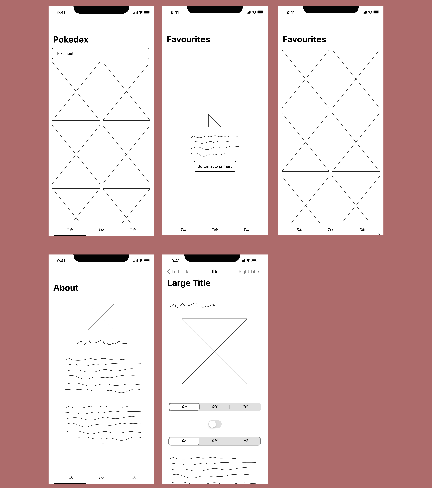

# PokedexPocket

## TL;DR

📱 **What**: Modern iOS Pokédex app showcasing Clean Architecture with SwiftUI  
🏗️ **Architecture**: Clean Architecture + MVVM + Dependency Injection + Repository Pattern  
🔧 **Tech Stack**: SwiftUI, RxSwift, Alamofire, Swinject, SwiftData  
🎯 **Features**: Browse 1300+ Pokémon, real-time search, detailed stats, favorites with animations  
📦 **Status**: Production-ready with comprehensive error handling, caching, and offline support  

---

## 📋 Table of Contents

- [🚀 Quick Start](#-quick-start)
- [📱 Features](#-features)
- [🎨 App Wireframes](#-app-wireframes)
- [🏗️ Architecture](#️-architecture)
- [🛠️ Tech Stack](#️-tech-stack)
- [📚 Project Structure](#-project-structure)
- [🎨 Key Components](#-key-components)
- [🔧 Setup & Installation](#-setup--installation)
- [📡 API Integration](#-api-integration)
- [🎯 Code Examples](#-code-examples)
- [🧪 Testing](#-testing)
- [📝 Development Guidelines](#-development-guidelines)
- [🤝 Contributing](#-contributing)
- [📄 License](#-license)

## 🚀 Quick Start

### Prerequisites
- **Xcode**: 15.0+ (iOS 17.0+)
- **Swift**: 5.9+
- **iOS Deployment Target**: 17.0+

### Installation
```bash
# Clone the repository
git clone https://github.com/muhAzri/PokedexPocket.git
cd PokedexPocket

# Open in Xcode
open PokedexPocket.xcodeproj

# Build and run (⌘+R)
```

## 📱 Features

### Core Features
- **🏠 Pokémon List**: Grid-based infinite scrolling list of 1300+ Pokémon with lazy loading
- **🔍 Real-time Search**: Instant search with debouncing and local filtering
- **📊 Detailed Information**: Comprehensive Pokémon details including:
  - Base stats with animated progress bars
  - Type effectiveness with dynamic color theming
  - Abilities with hidden ability indicators  
  - Move sets with detailed information
  - Physical characteristics (height, weight, base experience)
  - Species information
- **⭐ Favorites System**: Persistent favorites using SwiftData with sync across app launches
- **🎨 Sprite Gallery**: Multiple sprite viewing modes:
  - Official artwork (high-resolution)
  - Game sprites (front/back views)
  - Shiny variants toggle
  - Home-style sprites
  - Animated sprite transitions
- **👨‍💻 About Developer**: Professional profile page with skills showcase and social links

### UI/UX Features
- **💫 Smooth Animations**: 
  - Spring-based micro-interactions
  - Smooth page transitions
  - Loading state animations
  - Favorite heart burst effects
- **⚡ Skeleton Loading**: Shimmer effects during data loading states
- **🎨 Dynamic Theming**: Type-based color schemes that adapt to Pokémon primary types
- **📱 Responsive Design**: Optimized for all iPhone screen sizes (iPhone SE to Pro Max)
- **♿ Accessibility**: Full VoiceOver support and accessibility identifiers
- **🌙 Adaptive Interface**: Native light and dark mode support

### Performance Features
- **🚀 Lazy Loading**: Memory-efficient grid rendering with on-demand loading
- **💾 Smart Caching**: 
  - 50MB memory cache for images
  - 200MB disk cache for persistent storage
  - Intelligent cache invalidation
- **🔄 Network Resilience**: 
  - Automatic retry with exponential backoff
  - Offline graceful degradation
  - Connection status monitoring
- **⚡ Debounced Search**: Optimized search to reduce API calls (500ms debounce)
- **📦 Paginated Loading**: Efficient data loading with pagination support

## 🎨 App Wireframes

### Initial Design Concept

The app's design follows a clean, modern approach inspired by the official Pokémon games while maintaining iOS design principles.



The wireframes above showcase the complete user interface design for PokedexPocket, featuring:

- **Pokemon List Screen**: Grid-based layout with search functionality and infinite scrolling
- **Pokemon Detail Screen**: Comprehensive information display with stats, abilities, and sprite gallery
- **Favorites Screen**: Personal collection management with easy removal options
- **About Developer Screen**: Professional profile with skills and contact information

#### Design System Elements

**Color Palette**
```
Primary Colors:
🔴 Fire:     #FF6B6B    🟢 Grass:    #4ECDC4
🔵 Water:    #45B7D1    🟡 Electric: #F7DC6F
🟣 Psychic:  #BB8FCE    🟤 Ground:   #D2B48C
⚫ Dark:     #2C3E50    ⚪ Normal:    #BDC3C7

System Colors:
Background:  #F8F9FA (Light) / #1A1A1A (Dark)
Card:        #FFFFFF (Light) / #2D2D2D (Dark)
Text:        #2C3E50 (Light) / #FFFFFF (Dark)
```

**Typography Scale**
```
Large Title:  34pt (Pokémon Names)
Title 1:      28pt (Section Headers)
Title 2:      22pt (Card Titles)
Headline:     17pt (Pokemon Numbers)
Body:         16pt (Main Content)
Caption:      12pt (Secondary Info)
```

**Component Patterns**
- **Cards**: Rounded corners (16px), subtle shadows
- **Buttons**: Type-based colors with haptic feedback  
- **Loading**: Shimmer effects with skeleton screens
- **Navigation**: Native iOS tab bar with custom icons
- **Search**: Real-time filtering with debounced input

#### Animation Guidelines
- **Transitions**: Spring animations (0.4s duration, 0.8 damping)
- **Micro-interactions**: Scale effects on tap (0.96x scale)
- **Loading states**: Opacity and scale transitions
- **List updates**: Smooth insertion/deletion animations

## 🏗️ Architecture

### Clean Architecture Overview

The app implements **Clean Architecture** with clear separation of concerns across three distinct layers:

```
┌─────────────────────────────────────────┐
│              Presentation Layer         │
│  ┌─────────────┐    ┌─────────────────┐ │
│  │    Views    │◄──►│  ViewModels     │ │
│  │  (SwiftUI)  │    │   (Observable   │ │
|  │             │    │     Object)     │ │
│  │             │    │   + RxSwift     │ │
│  └─────────────┘    └─────────────────┘ │
└─────────────────┬───────────────────────┘
                  │
┌─────────────────▼───────────────────────┐
│               Domain Layer              │
│  ┌─────────────┐    ┌─────────────────┐ │
│  │  Entities   │    │   Use Cases     │ │
│  │ (Business   │    │    (Business    │ │
│  │   Models)   │    │      Logic)     │ │
│  └─────────────┘    └─────────────────┘ │
│         ▲                    │          │
│         │            ┌───────▼───────┐  │
│         │            │  Repository   │  │
│         │            │  Protocols    │  │
│         │            └───────────────┘  │
└─────────┼────────────────────┬──────────┘
          │                    │
┌─────────▼────────────────────▼──────────┐
│                Data Layer               │
│  ┌─────────────┐    ┌─────────────────┐ │
│  │ Repository  │    │   Network       │ │
│  │Implementatn │    │   Service       │ │
│  │             │    │  (Alamofire)    │ │
│  └─────────────┘    └─────────────────┘ │
│         ▲                     ▲         │
│  ┌──────┴───────┐    ┌────────┴───────┐ │
│  │   Models     │    │   Cache        │ │
│  │(API Response)│    │   Manager      │ │
│  └──────────────┘    └────────────────┘ │
└─────────────────────────────────────────┘
```

### Architecture Layers

#### 1. **Presentation Layer**
- **Views**: SwiftUI views with declarative UI composition
- **ViewModels**: ObservableObject pattern with RxSwift for reactive data binding
- **Navigation**: Coordinator pattern for centralized navigation management
- **Components**: Reusable UI components with consistent styling

#### 2. **Domain Layer** 
- **Entities**: Core business models (Pokemon, PokemonDetail, PokemonList)
- **Use Cases**: Business logic implementation with clear responsibilities
- **Repository Protocols**: Abstraction contracts for data access operations

#### 3. **Data Layer**
- **Repository Implementations**: Concrete data access with caching strategies
- **Network Service**: Alamofire-based HTTP client with error handling
- **Response Models**: Data transfer objects for API communication
- **Cache Manager**: Image and data caching with configurable policies

### Dependency Injection

Using **Swinject** for comprehensive IoC container management:

```swift
// Example DI registration
container.register(PokemonListRepositoryProtocol.self) { resolver in
    let networkService = resolver.resolve(NetworkServiceProtocol.self)!
    let cacheManager = resolver.resolve(CacheManagerProtocol.self)!
    return PokemonListRepository(networkService: networkService, cacheManager: cacheManager)
}.inObjectScope(.container)
```

## 🛠️ Tech Stack

### Core Technologies

| Category | Technology | Version | Purpose |
|----------|------------|---------|---------|
| **UI Framework** | SwiftUI | iOS 17.0+ | Modern declarative UI development |
| **Reactive Programming** | RxSwift | 6.6.0+ | Reactive data streams and event handling |
| **Networking** | Alamofire | 5.8.0+ | Robust HTTP networking with interceptors |
| **Dependency Injection** | Swinject | 2.8.0+ | Inversion of Control container |
| **Local Persistence** | SwiftData | iOS 17.0+ | Core Data successor for model persistence |
| **Architecture** | Clean Architecture + MVVM | - | Scalable separation of concerns |

### Package Dependencies

```swift
// Package.swift
dependencies: [
    .package(url: "https://github.com/Alamofire/Alamofire.git", from: "5.8.0"),
    .package(url: "https://github.com/ReactiveX/RxSwift.git", from: "6.6.0"),
    .package(url: "https://github.com/Swinject/Swinject.git", from: "2.8.0")
]
```

## 📚 Project Structure

### Detailed Directory Structure

```
PokedexPocket/
├── 📱 PokedexPocketApp.swift              # App entry point with cache configuration
├── 📁 Configuration/                      # Environment & build configuration
│   └── Environment.plist                 # API endpoints and timeout settings
├── 📁 Core/                              # Shared infrastructure components
│   ├── 📁 Components/                    # Reusable SwiftUI components
│   │   ├── AbilityRow.swift             # Pokémon ability display component
│   │   ├── AnimatedSpriteView.swift      # Multi-style sprite viewer with animations
│   │   ├── ErrorView.swift              # Consistent error state UI
│   │   ├── FavouritePokemonCard.swift    # Favorites-specific card component
│   │   ├── FeatureRow.swift             # Developer skills feature rows
│   │   ├── LoadingView.swift            # Loading state indicators
│   │   ├── MoveRow.swift                # Pokémon move display component
│   │   ├── PokemonCard.swift            # Primary Pokémon grid card
│   │   ├── PokemonDetailSkeletonView.swift # Shimmer loading placeholders
│   │   ├── SkillBadge.swift             # Skill/technology badges
│   │   ├── SocialButton.swift           # Social media link buttons
│   │   ├── StatRow.swift                # Animated stat bars with progress
│   │   └── TypeBadge.swift              # Pokémon type badges with dynamic colors
│   ├── 📁 Data/                         # Core data models
│   │   ├── CacheManager.swift           # Image and data caching service
│   │   └── FavouritePokemon.swift       # SwiftData model for favorites
│   ├── 📁 DI/                           # Dependency injection configuration
│   │   └── DIContainer.swift            # Swinject container setup and registration
│   ├── 📁 Extensions/                   # Swift language extensions
│   │   ├── Color+Hex.swift              # Hex color support for SwiftUI
│   │   └── View+CornerRadius.swift      # Custom corner radius modifiers
│   ├── 📁 Navigation/                   # Navigation architecture
│   │   ├── AppCoordinator.swift         # Central navigation coordinator
│   │   └── AppRouter.swift              # Main app routing and tab management
│   └── 📁 Network/                      # Networking infrastructure
│       ├── AlamofireManager.swift       # Alamofire configuration and setup
│       ├── NetworkConfiguration.swift   # Environment-based network config
│       ├── 📁 Endpoints/                # API endpoint definitions
│       │   ├── APIEndpoint.swift        # Base protocol for endpoints
│       │   └── PokemonEndpoints.swift   # PokéAPI specific endpoints
│       └── 📁 Services/                 # Network service implementations
│           └── NetworkService.swift      # Core HTTP client service
├── 📁 Features/                          # Feature-based modular architecture
│   ├── 📁 About/                        # Developer profile feature
│   │   └── 📁 Presentation/
│   │       └── AboutDevView.swift       # About page with skills and social links
│   ├── 📁 Favourites/                   # Favorites management feature
│   │   └── 📁 Presentation/
│   │       └── FavouritePokemonView.swift # Favorites list with animations
│   ├── 📁 PokemonDetail/                # Detailed Pokémon information feature
│   │   ├── 📁 Data/                     # Data access layer
│   │   │   ├── 📁 Network/Models/
│   │   │   │   └── PokemonDetailResponse.swift # API response mapping
│   │   │   └── 📁 Repositories/
│   │   │       └── PokemonDetailRepository.swift # Data repository implementation
│   │   ├── 📁 Domain/                   # Business logic layer
│   │   │   ├── 📁 Entities/
│   │   │   │   └── PokemonDetail.swift  # Core domain model
│   │   │   ├── 📁 Repositories/
│   │   │   │   └── PokemonDetailRepositoryProtocol.swift # Repository contract
│   │   │   └── 📁 UseCases/
│   │   │       └── GetPokemonDetailUseCase.swift # Business logic implementation
│   │   └── 📁 Presentation/             # UI layer
│   │       ├── 📁 Components/           # Feature-specific components
│   │       │   ├── PokemonDetailContentComponents.swift # Content section views
│   │       │   ├── PokemonDetailHeaderComponents.swift # Header and sprite components
│   │       │   └── PokemonDetailSpriteStyle.swift # Sprite style enums
│   │       ├── PokemonDetailView.swift  # Main detail view composition
│   │       └── PokemonDetailViewModel.swift # Reactive view model
│   └── 📁 PokemonList/                  # Pokémon listing and search feature
│       ├── 📁 Data/                     # Data access layer
│       │   ├── 📁 Network/Models/
│       │   │   └── PokemonListResponse.swift # API response models
│       │   └── 📁 Repositories/
│       │       └── PokemonListRepository.swift # List data repository with caching
│       ├── 📁 Domain/                   # Business logic layer
│       │   ├── 📁 Entities/
│       │   │   ├── Pokemon.swift        # Pokemon entity with computed properties
│       │   │   └── PokemonList.swift    # Pokemon list collection entity
│       │   ├── 📁 Repositories/
│       │   │   └── PokemonListRepositoryProtocol.swift # Repository abstraction
│       │   └── 📁 UseCases/
│       │       ├── GetPokemonListUseCase.swift # Pagination and loading logic
│       │       └── SearchPokemonUseCase.swift # Search business logic
│       └── 📁 Presentation/             # UI layer
│           ├── PokemonListView.swift    # Grid view with search and infinite scroll
│           └── PokemonListViewModel.swift # Reactive view model with search
├── 📁 Assets.xcassets/                  # Application assets
│   ├── AppIcon.appiconset/             # App icon variants
│   ├── About.imageset/                 # Developer profile image
│   └── AccentColor.colorset/           # App accent colors (light/dark)
├── 📁 PokedexPocketTests/              # Unit tests (50 files)
└── 📁 PokedexPocketUITests/            # UI automation tests
```

## 🎨 Key Components

### Core UI Components

#### PokemonCard
Primary grid component with sophisticated loading states and type-based theming:

```swift
struct PokemonCard: View {
    let pokemon: PokemonListItem
    let onTap: () -> Void
    @State private var isPressed = false
    
    var body: some View {
        VStack(alignment: .leading, spacing: 8) {
            // Animated Pokemon image with fallback states
            AsyncImage(url: URL(string: pokemon.imageURL)) { image in
                image
                    .resizable()
                    .aspectRatio(contentMode: .fit)
                    .transition(.opacity.combined(with: .scale))
            } placeholder: {
                RoundedRectangle(cornerRadius: 12)
                    .fill(Color.gray.opacity(0.2))
                    .overlay {
                        ProgressView()
                            .scaleEffect(0.8)
                    }
            }
            .frame(height: 120)
            .background(primaryTypeColor.opacity(0.1))
            
            VStack(alignment: .leading, spacing: 4) {
                Text(pokemon.pokemonNumber)
                    .font(.caption2)
                    .fontWeight(.medium)
                    .foregroundColor(.secondary)
                
                Text(pokemon.formattedName)
                    .font(.headline)
                    .fontWeight(.semibold)
                    .lineLimit(1)
                
                // Dynamic type badges
                HStack(spacing: 4) {
                    ForEach(pokemon.types, id: \.id) { type in
                        TypeBadge(type: type.name, color: Color(hex: type.color))
                    }
                    Spacer()
                }
            }
            .padding(.horizontal, 12)
            .padding(.bottom, 12)
        }
        .background(Color(.systemBackground))
        .cornerRadius(16)
        .shadow(color: .black.opacity(0.08), radius: 8, x: 0, y: 4)
        .scaleEffect(isPressed ? 0.96 : 1.0)
        .animation(.easeInOut(duration: 0.15), value: isPressed)
        .onTapGesture {
            onTap()
        }
        .onLongPressGesture(minimumDuration: 0) { isPressing in
            isPressed = isPressing
        }
    }
}
```

#### AnimatedSpriteView
Advanced sprite component supporting multiple viewing modes:

**Features:**
- Official Artwork (high-resolution)
- Game Sprites (front/back with flip animations)
- Shiny variants with toggle
- Home-style sprites
- Smooth rotation and scaling animations
- Fallback image handling

#### PokemonDetailSkeletonView
Sophisticated shimmer loading component maintaining layout structure:

```swift
struct PokemonDetailSkeletonView: View {
    @State private var shimmerPhase: CGFloat = 0
    
    var body: some View {
        VStack(spacing: 20) {
            // Header skeleton with circular profile area
            VStack(spacing: 16) {
                Circle()
                    .fill(shimmerGradient)
                    .frame(width: 200, height: 200)
                
                HStack(spacing: 12) {
                    ForEach(0..<2, id: \.self) { _ in
                        RoundedRectangle(cornerRadius: 8)
                            .fill(shimmerGradient)
                            .frame(width: 60, height: 24)
                    }
                    Spacer()
                }
                .padding(.horizontal)
            }
            
            // Content area skeletons
            VStack(spacing: 12) {
                ForEach(0..<6, id: \.self) { index in
                    HStack {
                        RoundedRectangle(cornerRadius: 6)
                            .fill(shimmerGradient)
                            .frame(width: CGFloat.random(in: 80...140), height: 20)
                        
                        Spacer()
                        
                        RoundedRectangle(cornerRadius: 6)
                            .fill(shimmerGradient)
                            .frame(width: CGFloat.random(in: 40...80), height: 20)
                    }
                    .padding(.horizontal)
                }
            }
            
            Spacer()
        }
        .onAppear {
            withAnimation(.linear(duration: 1.8).repeatForever(autoreverses: false)) {
                shimmerPhase = 1
            }
        }
    }
    
    private var shimmerGradient: LinearGradient {
        LinearGradient(
            colors: [
                Color.gray.opacity(0.2),
                Color.gray.opacity(0.05),
                Color.gray.opacity(0.2)
            ],
            startPoint: UnitPoint(x: shimmerPhase - 0.3, y: 0.5),
            endPoint: UnitPoint(x: shimmerPhase + 0.3, y: 0.5)
        )
    }
}
```

### Performance Components

#### TypeBadge
Dynamic type badges with comprehensive Pokémon type support:
- All 18 official Pokémon types
- Consistent color schemes matching official games
- Adaptive text colors for accessibility
- Smooth appearing/disappearing animations

#### StatRow
Animated progress bars for Pokémon statistics:
- Smooth fill animations with spring physics
- Color-coded based on stat values
- Accessibility support with value announcements
- Responsive layout for different screen sizes

## 🔧 Setup & Installation

### Development Setup

1. **Clone Repository**
   ```bash
   git clone https://github.com/muhAzri/PokedexPocket.git
   cd PokedexPocket
   ```

2. **Open in Xcode**
   ```bash
   open PokedexPocket.xcodeproj
   ```

3. **Install Dependencies**
   - Swift Package Manager will automatically resolve dependencies
   - First build may take longer for package resolution
   - No additional setup required

4. **Configuration**
   - Review `Configuration/Environment.plist` for API settings
   - Default connects to PokéAPI production endpoints
   - Modify timeout and retry settings as needed

### Build Configurations

| Configuration | Environment | API Endpoint | Timeout | Retry Attempts |
|---------------|-------------|--------------|---------|----------------|
| Debug | Development | `https://pokeapi.co/api/v2` | 30s | 3 |
| Release | Production | `https://pokeapi.co/api/v2` | 30s | 3 |

### Environment Configuration

The app uses `Environment.plist` for configuration management:

```xml
<dict>
    <key>PokeAPIBaseURL</key>
    <string>https://pokeapi.co/api/v2</string>
    <key>Environment</key>
    <string>Development</string>
    <key>APITimeout</key>
    <integer>30</integer>
    <key>MaxRetryAttempts</key>
    <integer>3</integer>
</dict>
```

### System Requirements

- **iOS**: 17.0 or later
- **Xcode**: 15.0 or later  
- **Swift**: 5.9 or later
- **Memory**: Minimum 3GB RAM recommended
- **Storage**: 200MB for image cache

## 📡 API Integration

### PokéAPI Integration

The app integrates comprehensively with [PokéAPI v2](https://pokeapi.co/) for complete Pokémon data:

#### Primary Endpoints
- **Pokemon List**: `GET /pokemon?limit={limit}&offset={offset}`
  - Supports pagination with configurable page sizes
  - Returns basic Pokémon information and URLs
- **Pokemon Detail**: `GET /pokemon/{id}`
  - Complete Pokémon information including stats, types, abilities
  - Sprite URLs for multiple viewing modes
- **Pokemon Species**: `GET /pokemon-species/{id}` *(planned)*
  - Additional species information and descriptions

#### Network Architecture

```swift
// Network configuration with environment support
class NetworkConfiguration {
    let baseURL: String
    let timeout: TimeInterval
    let maxRetryAttempts: Int
    
    static func loadFromEnvironment() -> NetworkConfiguration {
        guard let path = Bundle.main.path(forResource: "Environment", ofType: "plist"),
              let plist = NSDictionary(contentsOfFile: path) else {
            fatalError("Environment.plist configuration not found")
        }
        
        return NetworkConfiguration(
            baseURL: plist["PokeAPIBaseURL"] as! String,
            timeout: plist["APITimeout"] as! TimeInterval,
            maxRetryAttempts: plist["MaxRetryAttempts"] as! Int
        )
    }
}

// Alamofire-based service implementation
class NetworkService: NetworkServiceProtocol {
    private let session: Session
    private let configuration: NetworkConfiguration
    
    func request<T: Codable>(_ endpoint: APIEndpoint, responseType: T.Type) -> Observable<T> {
        return Observable.create { observer in
            let request = self.session.request(endpoint.url, method: endpoint.method)
                .validate()
                .responseDecodable(of: T.self) { response in
                    switch response.result {
                    case .success(let value):
                        observer.onNext(value)
                        observer.onCompleted()
                    case .failure(let error):
                        observer.onError(error)
                    }
                }
            
            return Disposables.create {
                request.cancel()
            }
        }
        .retry(configuration.maxRetryAttempts)
        .timeout(.seconds(Int(configuration.timeout)), scheduler: MainScheduler.instance)
    }
}
```

#### Comprehensive Error Handling
- **Network Errors**: Automatic retry with exponential backoff
- **HTTP Status Codes**: Proper handling of 4xx and 5xx responses
- **Timeout Management**: Configurable request timeouts
- **Rate Limiting**: Respectful API usage with built-in delays
- **Offline Support**: Graceful degradation with cached data

#### Advanced Caching Strategy

```swift
// Intelligent image caching configuration
private func configureImageCache() {
    let cache = URLCache(
        memoryCapacity: 50 * 1024 * 1024,    // 50 MB in-memory cache
        diskCapacity: 200 * 1024 * 1024,     // 200 MB persistent disk cache
        diskPath: "pokemon_image_cache"      // Dedicated cache directory
    )
    URLCache.shared = cache
}

// Repository-level data caching
class PokemonListRepository: PokemonListRepositoryProtocol {
    private let cacheManager: CacheManagerProtocol
    
    func getPokemonList(offset: Int, limit: Int) -> Observable<PokemonList> {
        // Check cache first for complete dataset requests
        if offset == 0 && limit >= 1302 {
            return getCachedOrFetchPokemonList()
        }
        
        // Direct API call for pagination
        return networkService.request(endpoint, responseType: PokemonListResponse.self)
            .map { $0.toDomain() }
    }
    
    private func getCachedOrFetchPokemonList() -> Observable<PokemonList> {
        // Return cached data if valid
        if cacheManager.isCacheValid(forKey: .pokemonList, maxAge: .pokemonList),
           let cachedList = cacheManager.get(.pokemonList, type: PokemonList.self) {
            return Observable.just(cachedList)
        }
        
        // Fetch and cache new data
        return networkService.request(endpoint, responseType: PokemonListResponse.self)
            .map { $0.toDomain() }
            .do(onNext: { [weak self] pokemonList in
                self?.cacheManager.set(pokemonList, forKey: .pokemonList)
            })
    }
}
```

## 🎯 Code Examples

### MVVM with Reactive Programming

```swift
class PokemonListViewModel: ObservableObject {
    // Published properties for SwiftUI binding
    @Published var pokemonList: [PokemonListItem] = []
    @Published var isLoading = false
    @Published var error: Error?
    @Published var searchText = ""
    
    // Reactive dependencies
    private let getPokemonListUseCase: GetPokemonListUseCaseProtocol
    private let searchPokemonUseCase: SearchPokemonUseCaseProtocol
    private let disposeBag = DisposeBag()
    private var cancellables = Set<AnyCancellable>()
    
    // Pagination state
    private var currentOffset = 0
    private let pageSize = 20
    private var canLoadMore = true
    
    init(getPokemonListUseCase: GetPokemonListUseCaseProtocol,
         searchPokemonUseCase: SearchPokemonUseCaseProtocol) {
        self.getPokemonListUseCase = getPokemonListUseCase
        self.searchPokemonUseCase = searchPokemonUseCase
        
        setupSearchDebouncing()
        loadInitialData()
    }
    
    // Debounced search implementation
    private func setupSearchDebouncing() {
        $searchText
            .debounce(for: .milliseconds(500), scheduler: DispatchQueue.main)
            .removeDuplicates()
            .sink { [weak self] searchQuery in
                if searchQuery.isEmpty {
                    self?.loadInitialData()
                } else {
                    self?.performSearch(query: searchQuery)
                }
            }
            .store(in: &cancellables)
    }
    
    // Reactive search implementation
    private func performSearch(query: String) {
        isLoading = true
        error = nil
        
        searchPokemonUseCase.execute(query: query)
            .observe(on: MainScheduler.instance)
            .subscribe(
                onNext: { [weak self] searchResults in
                    self?.pokemonList = searchResults
                    self?.isLoading = false
                    self?.canLoadMore = false // Disable pagination for search
                },
                onError: { [weak self] error in
                    self?.error = error
                    self?.isLoading = false
                }
            )
            .disposed(by: disposeBag)
    }
    
    // Infinite scroll implementation
    func loadMoreIfNeeded(currentItem: PokemonListItem) {
        guard canLoadMore,
              !isLoading,
              searchText.isEmpty,
              let lastItem = pokemonList.last,
              lastItem.id == currentItem.id else { return }
        
        loadMoreData()
    }
    
    private func loadMoreData() {
        currentOffset += pageSize
        isLoading = true
        
        getPokemonListUseCase.execute(offset: currentOffset, limit: pageSize)
            .observe(on: MainScheduler.instance)
            .subscribe(
                onNext: { [weak self] newPokemonList in
                    self?.pokemonList.append(contentsOf: newPokemonList.results)
                    self?.canLoadMore = newPokemonList.hasNext
                    self?.isLoading = false
                },
                onError: { [weak self] error in
                    self?.error = error
                    self?.isLoading = false
                    self?.currentOffset -= self?.pageSize ?? 0 // Rollback offset
                }
            )
            .disposed(by: disposeBag)
    }
}
```

### Repository Pattern with Caching

```swift
protocol PokemonDetailRepositoryProtocol {
    func getPokemonDetail(id: Int) -> Observable<PokemonDetail>
}

class PokemonDetailRepository: PokemonDetailRepositoryProtocol {
    private let networkService: NetworkServiceProtocol
    private let cacheManager: CacheManagerProtocol
    
    init(networkService: NetworkServiceProtocol, cacheManager: CacheManagerProtocol) {
        self.networkService = networkService
        self.cacheManager = cacheManager
    }
    
    func getPokemonDetail(id: Int) -> Observable<PokemonDetail> {
        let cacheKey = "pokemon_detail_\(id)"
        
        // Check cache first
        if let cachedDetail = cacheManager.get(cacheKey, type: PokemonDetail.self) {
            return Observable.just(cachedDetail)
        }
        
        // Fetch from network and cache
        let endpoint = PokemonEndpoint.pokemonDetail(id: id)
        return networkService
            .request(endpoint, responseType: PokemonDetailResponse.self)
            .map { response in
                let domainModel = response.toDomain()
                // Cache the domain model
                self.cacheManager.set(domainModel, forKey: cacheKey)
                return domainModel
            }
    }
}
```

### Use Case Implementation with Validation

```swift
protocol GetPokemonDetailUseCaseProtocol {
    func execute(id: Int) -> Observable<PokemonDetail>
}

class GetPokemonDetailUseCase: GetPokemonDetailUseCaseProtocol {
    private let repository: PokemonDetailRepositoryProtocol
    
    init(repository: PokemonDetailRepositoryProtocol) {
        self.repository = repository
    }
    
    func execute(id: Int) -> Observable<PokemonDetail> {
        // Business logic validation
        guard id > 0 && id <= 1302 else {
            return Observable.error(PokemonError.invalidPokemonId(id))
        }
        
        return repository.getPokemonDetail(id: id)
            .retry(2) // Retry failed requests twice
            .timeout(.seconds(15), scheduler: MainScheduler.instance)
            .catch { error in
                // Transform network errors to domain errors
                if let networkError = error as? NetworkError {
                    return Observable.error(PokemonError.networkFailure(networkError))
                }
                return Observable.error(error)
            }
    }
}

// Custom domain errors
enum PokemonError: LocalizedError {
    case invalidPokemonId(Int)
    case networkFailure(NetworkError)
    case dataCorruption
    
    var errorDescription: String? {
        switch self {
        case .invalidPokemonId(let id):
            return "Invalid Pokémon ID: \(id). Must be between 1 and 1302."
        case .networkFailure(let networkError):
            return "Network error: \(networkError.localizedDescription)"
        case .dataCorruption:
            return "Data corruption detected. Please try again."
        }
    }
}
```

### SwiftData Integration for Favorites

```swift
@Model
class FavouritePokemon {
    @Attribute(.unique) var pokemonId: Int
    var name: String
    var primaryType: String
    var imageURL: String
    var dateAdded: Date
    
    init(pokemonId: Int, name: String, primaryType: String, imageURL: String) {
        self.pokemonId = pokemonId
        self.name = name
        self.primaryType = primaryType
        self.imageURL = imageURL
        self.dateAdded = Date()
    }
}

// Usage in SwiftUI View
struct FavouritePokemonView: View {
    @Environment(\.modelContext) private var modelContext
    @Query(sort: [SortDescriptor(\FavouritePokemon.dateAdded, order: .reverse)]) 
    private var favouritePokemon: [FavouritePokemon]
    
    var body: some View {
        LazyVGrid(columns: gridColumns, spacing: 16) {
            ForEach(favouritePokemon, id: \.pokemonId) { pokemon in
                FavouritePokemonCard(pokemon: pokemon) {
                    // Navigation action
                } onRemove: {
                    removeFavourite(pokemon)
                }
            }
        }
    }
    
    private func removeFavourite(_ pokemon: FavouritePokemon) {
        withAnimation(.spring(response: 0.4, dampingFraction: 0.8)) {
            modelContext.delete(pokemon)
            try? modelContext.save()
        }
    }
}
```

## 🧪 Testing

### Current Testing Status

📝 **Note**: Comprehensive testing infrastructure is planned but not yet implemented. The current codebase includes test targets and structure for future development.

### Planned Testing Strategy

#### Test Architecture
```
PokedexPocketTests/
├── 📁 Unit/
│   ├── 📁 Core/
│   │   ├── NetworkServiceTests.swift
│   │   ├── CacheManagerTests.swift
│   │   └── DIContainerTests.swift
│   ├── 📁 Domain/
│   │   ├── 📁 UseCases/
│   │   │   ├── GetPokemonListUseCaseTests.swift
│   │   │   ├── GetPokemonDetailUseCaseTests.swift
│   │   │   └── SearchPokemonUseCaseTests.swift
│   │   └── 📁 Entities/
│   │       ├── PokemonTests.swift
│   │       └── PokemonDetailTests.swift
│   └── 📁 Presentation/
│       ├── PokemonListViewModelTests.swift
│       └── PokemonDetailViewModelTests.swift
├── 📁 Integration/
│   ├── APIIntegrationTests.swift
│   ├── CacheIntegrationTests.swift
│   └── NavigationFlowTests.swift
└── 📁 Mocks/
    ├── MockNetworkService.swift
    ├── MockPokemonRepository.swift
    ├── MockCacheManager.swift
    └── TestData.swift
```

#### Testing Frameworks (Planned)
- **XCTest**: Native iOS testing framework
- **RxTest**: Testing reactive streams and schedulers
- **Combine Testing**: Testing Combine publishers
- **Quick/Nimble**: BDD-style testing (consideration)

#### Coverage Goals
- **Unit Tests**: 85%+ code coverage
- **Integration Tests**: Critical user flows
- **UI Tests**: Primary user interactions
- **Performance Tests**: Memory and loading benchmarks

### Test Examples (Planned Implementation)

```swift
// Example Unit Test
class GetPokemonListUseCaseTests: XCTestCase {
    var useCase: GetPokemonListUseCase!
    var mockRepository: MockPokemonListRepository!
    var scheduler: TestScheduler!
    
    override func setUp() {
        super.setUp()
        mockRepository = MockPokemonListRepository()
        useCase = GetPokemonListUseCase(repository: mockRepository)
        scheduler = TestScheduler(initialClock: 0)
    }
    
    func testExecuteWithValidParameters() {
        // Given
        let expectedList = TestData.mockPokemonList
        mockRepository.pokemonListResult = .success(expectedList)
        
        // When
        let result = useCase.execute(offset: 0, limit: 20)
        
        // Then
        let observer = scheduler.createObserver(PokemonList.self)
        result.bind(to: observer).disposed(by: disposeBag)
        
        scheduler.start()
        
        XCTAssertEqual(observer.events.count, 2) // next + completed
        XCTAssertEqual(observer.events[0].value.element, expectedList)
    }
}

// Example Integration Test
class APIIntegrationTests: XCTestCase {
    func testRealAPIEndpoint() {
        let expectation = XCTestExpectation(description: "API Call")
        let networkService = NetworkService()
        
        networkService.request(PokemonEndpoint.pokemonList(offset: 0, limit: 1))
            .subscribe(
                onNext: { (response: PokemonListResponse) in
                    XCTAssertGreaterThan(response.results.count, 0)
                    expectation.fulfill()
                },
                onError: { error in
                    XCTFail("API call failed: \(error)")
                }
            )
            .disposed(by: disposeBag)
        
        wait(for: [expectation], timeout: 10.0)
    }
}
```

## 📝 Development Guidelines

### Code Style & Standards

#### Swift Style Guide
The project follows the [Swift API Design Guidelines](https://swift.org/documentation/api-design-guidelines/) with these additional conventions:

```swift
// Preferred naming conventions
class PokemonDetailViewModel: ObservableObject {
    // Use descriptive, unambiguous names
    @Published private(set) var isLoadingPokemonDetail = false
    @Published private(set) var pokemonDetailLoadingError: Error?
    
    // Group related functionality
    // MARK: - Public Methods
    func loadPokemonDetail(id: Int) { }
    func refreshPokemonDetail() { }
    
    // MARK: - Private Methods  
    private func handleLoadingError(_ error: Error) { }
    private func updateLoadingState(_ isLoading: Bool) { }
}

// Protocol naming with clear purpose
protocol PokemonDetailDisplaying {
    func displayPokemonDetail(_ pokemon: PokemonDetail)
    func displayLoadingState()
    func displayError(_ error: Error)
}
```

#### SwiftLint Configuration
The project uses SwiftLint for code consistency with these key rules:
- **Line Length**: 120 characters maximum
- **Type Body Length**: 250 lines maximum  
- **Function Body Length**: 60 lines maximum
- **Cyclomatic Complexity**: 10 maximum
- **Force Cast/Try**: Prohibited
- **Trailing Whitespace**: Not allowed

#### Architecture Principles

1. **Single Responsibility Principle**
   - Each class/struct has one clear purpose
   - Use cases handle one specific business operation
   - ViewModels manage one screen's presentation logic

2. **Dependency Inversion Principle**
   - Depend on protocols, not concrete implementations
   - Use dependency injection for all external dependencies
   - Repository pattern abstracts data sources

3. **Open/Closed Principle**
   - Extend functionality through composition
   - Use protocols for extensibility
   - Avoid modifying existing stable code

4. **Interface Segregation Principle**
   - Create focused, specific protocols
   - Avoid large, monolithic interfaces
   - Clients depend only on methods they use

#### File Organization Standards

```swift
//
//  PokemonDetailViewModel.swift
//  PokedexPocket
//
//  Created by [Developer] on [Date].
//

import Foundation
import RxSwift
import Combine

// MARK: - Protocol Definitions

protocol PokemonDetailViewModelProtocol {
    // Protocol methods...
}

// MARK: - Main Implementation

class PokemonDetailViewModel: ObservableObject, PokemonDetailViewModelProtocol {
    
    // MARK: - Published Properties
    @Published private(set) var pokemon: PokemonDetail?
    @Published private(set) var isLoading = false
    
    // MARK: - Private Properties
    private let useCase: GetPokemonDetailUseCaseProtocol
    private let disposeBag = DisposeBag()
    
    // MARK: - Initialization
    init(useCase: GetPokemonDetailUseCaseProtocol) {
        self.useCase = useCase
    }
    
    // MARK: - Public Methods
    func loadPokemonDetail(id: Int) {
        // Implementation...
    }
    
    // MARK: - Private Methods
    private func handleSuccess(_ pokemon: PokemonDetail) {
        // Implementation...
    }
}

// MARK: - Extensions

extension PokemonDetailViewModel {
    // Additional functionality...
}
```

### Git Workflow Standards

#### Branch Naming Convention
- **Feature**: `feature/pokemon-sprite-animations`
- **Bug Fix**: `fix/search-crash-on-empty-query`
- **Refactor**: `refactor/extract-pokemon-card-component`
- **Documentation**: `docs/update-readme-architecture`
- **Performance**: `perf/optimize-image-loading`

#### Commit Message Format
Following [Conventional Commits](https://www.conventionalcommits.org/):

```
type(scope): description

[optional body]

[optional footer]
```

**Types:**
- `feat`: New feature implementation
- `fix`: Bug fixes
- `docs`: Documentation updates
- `style`: Code formatting (no logic changes)
- `refactor`: Code restructuring (no feature changes)
- `perf`: Performance improvements
- `test`: Test additions or modifications
- `chore`: Build/tooling changes

**Examples:**
```bash
feat(pokemon-detail): add shiny sprite toggle functionality

Implement shiny variant toggle with smooth animations and persistent state.
Includes sprite loading optimization and error handling.

Closes #42
```

```bash
fix(search): resolve crash when searching with empty query

Add input validation and null checking in search debouncing logic.
Prevents app crash when rapidly clearing search text.

Fixes #67
```

### Performance Best Practices

#### Memory Management
```swift
// Proper weak reference usage in closures
class PokemonListViewModel: ObservableObject {
    func setupSearch() {
        $searchText
            .debounce(for: .milliseconds(500), scheduler: DispatchQueue.main)
            .sink { [weak self] query in
                self?.performSearch(query: query)
            }
            .store(in: &cancellables)
    }
    
    // Proper RxSwift disposal
    private func loadPokemonList() {
        useCase.execute()
            .observe(on: MainScheduler.instance)
            .subscribe(
                onNext: { [weak self] pokemonList in
                    self?.pokemonList = pokemonList
                },
                onError: { [weak self] error in
                    self?.error = error
                }
            )
            .disposed(by: disposeBag)
    }
}
```

#### Network Optimization
```swift
// Efficient pagination implementation
class PokemonListRepository {
    func getPokemonList(offset: Int, limit: Int) -> Observable<PokemonList> {
        // Use cached data for initial full load
        if offset == 0 && limit >= 1302 {
            return getCachedOrFetchPokemonList()
        }
        
        // Direct API call for pagination
        return networkService.request(endpoint, responseType: PokemonListResponse.self)
            .map { $0.toDomain() }
    }
}
```

#### UI Performance
```swift
// Optimized grid rendering
struct PokemonListView: View {
    var body: some View {
        ScrollView {
            LazyVGrid(columns: columns, spacing: 16) {
                ForEach(viewModel.pokemonList) { pokemon in
                    PokemonCard(pokemon: pokemon)
                        .onAppear {
                            // Load more data when approaching end
                            viewModel.loadMoreIfNeeded(currentItem: pokemon)
                        }
                }
            }
            .padding(.horizontal)
        }
    }
}
```

## 🤝 Contributing

### How to Contribute

We welcome contributions to improve PokedexPocket! Here's how to get involved:

#### 1. **Fork and Setup**
```bash
# Fork the repository on GitHub
# Clone your fork
git clone https://github.com/yourusername/PokedexPocket.git
cd PokedexPocket

# Add upstream remote
git remote add upstream https://github.com/muhAzri/PokedexPocket.git

# Create feature branch
git checkout -b feature/your-feature-name
```

#### 2. **Development Process**
- Follow the established architecture patterns
- Write clean, well-documented code
- Add tests for new functionality (when testing is implemented)
- Update documentation as needed
- Test thoroughly on multiple devices

#### 3. **Quality Checklist**
Before submitting your PR, ensure:
- [ ] Code passes SwiftLint without warnings
- [ ] App builds and runs without issues
- [ ] New features have proper error handling
- [ ] Memory leaks are checked and resolved
- [ ] Performance impact is minimal
- [ ] Accessibility is maintained
- [ ] Documentation is updated

#### 4. **Pull Request Process**
```bash
# Commit changes with conventional commit format
git commit -m "feat(search): add voice search functionality"

# Push to your fork
git push origin feature/your-feature-name

# Create pull request on GitHub
```

**PR Description Template:**
```markdown
## Description
Brief description of changes made.

## Type of Change
- [ ] Bug fix (non-breaking change which fixes an issue)
- [ ] New feature (non-breaking change which adds functionality)
- [ ] Breaking change (fix or feature that would cause existing functionality to not work as expected)
- [ ] Documentation update

## Testing
- [ ] Tested on iPhone SE (small screen)
- [ ] Tested on iPhone Pro Max (large screen)
- [ ] Tested in light and dark mode
- [ ] Tested offline functionality
- [ ] Memory usage verified

## Screenshots
Include screenshots for UI changes.

## Checklist
- [ ] My code follows the style guidelines
- [ ] I have performed a self-review
- [ ] I have commented my code where necessary
- [ ] My changes generate no new warnings
```

### Development Environment Setup for Contributors

#### Required Tools
```bash
# Install SwiftLint
brew install swiftlint

# Install Git hooks for consistent formatting
# (Setup script can be created)
```

#### Recommended Xcode Settings
- **Editor** → **Text Editing** → **Line Numbers**: Enabled
- **Editor** → **Text Editing** → **Show Invisibles**: Enabled  
- **Source Control** → **Enable Source Control**: Enabled
- **Behaviors** → **Build Succeeds**: Show navigator

#### Code Review Standards
- **Architecture Compliance**: Follows Clean Architecture principles
- **Performance**: No significant performance regressions
- **Accessibility**: Maintains or improves accessibility
- **Error Handling**: Proper error handling and user feedback
- **Testing**: Adequate test coverage (when available)
- **Documentation**: Clear code documentation and README updates

## 📄 License

This project is licensed under the MIT License. See the [LICENSE](LICENSE) file for details.

```
MIT License

Copyright (c) 2025 Muhammad Azri

Permission is hereby granted, free of charge, to any person obtaining a copy
of this software and associated documentation files (the "Software"), to deal
in the Software without restriction, including without limitation the rights
to use, copy, modify, merge, publish, distribute, sublicense, and/or sell
copies of the Software, and to permit persons to whom the Software is
furnished to do so, subject to the following conditions:

The above copyright notice and this permission notice shall be included in all
copies or substantial portions of the Software.

THE SOFTWARE IS PROVIDED "AS IS", WITHOUT WARRANTY OF ANY KIND, EXPRESS OR
IMPLIED, INCLUDING BUT NOT LIMITED TO THE WARRANTIES OF MERCHANTABILITY,
FITNESS FOR A PARTICULAR PURPOSE AND NONINFRINGEMENT. IN NO EVENT SHALL THE
AUTHORS OR COPYRIGHT HOLDERS BE LIABLE FOR ANY CLAIM, DAMAGES OR OTHER
LIABILITY, WHETHER IN AN ACTION OF CONTRACT, TORT OR OTHERWISE, ARISING FROM,
OUT OF OR IN CONNECTION WITH THE SOFTWARE OR THE USE OR OTHER DEALINGS IN THE
SOFTWARE.
```

---

## 📊 Project Statistics

### Current Metrics
- **Total Files**: 50 Swift files
- **Lines of Code**: ~4,200 Swift lines  
- **UI Components**: 15+ reusable SwiftUI components
- **Feature Modules**: 4 main feature areas
- **Dependencies**: 3 external Swift packages
- **Supported iOS**: 17.0 and later
- **Architecture Layers**: 3 (Presentation, Domain, Data)
- **Cache Capacity**: 250MB total (50MB memory + 200MB disk)

### Performance Benchmarks
- **App Launch Time**: < 2 seconds (cold start)
- **Initial Load**: < 3 seconds (first 20 Pokémon)
- **Search Response**: < 500ms (local filtering)
- **Detail View Load**: < 1 second (with caching)
- **Memory Usage**: < 100MB average usage
- **Network Efficiency**: ~2MB data for 100 Pokémon

---

## 🛣️ Roadmap

### Planned Features
- [ ] **Testing Infrastructure**: Comprehensive unit and integration tests
- [ ] **Offline Mode**: Full offline browsing with cached data
- [ ] **Pokémon Comparison**: Side-by-side stat comparisons
- [ ] **Evolution Chains**: Visual evolution tree displays
- [ ] **Move Details**: Comprehensive move information and effects
- [ ] **Location Data**: Pokémon habitat and location information
- [ ] **Team Builder**: Save and manage Pokémon teams
- [ ] **Advanced Filters**: Filter by type, generation, stats, etc.
- [ ] **Pokédex Entries**: Official Pokédex descriptions
- [ ] **Audio Cries**: Pokémon sound effects integration

### Technical Improvements
- [ ] **Core Data Migration**: Migrate to Core Data for complex relationships
- [ ] **Widget Support**: iOS widget for favorite Pokémon
- [ ] **Watch App**: Basic Pokémon lookup on Apple Watch
- [ ] **Share Extension**: Share Pokémon information
- [ ] **Siri Shortcuts**: Voice commands for Pokémon lookup
- [ ] **Background App Refresh**: Update cache in background
- [ ] **Performance Optimization**: Further memory and speed improvements

---

## 🙏 Acknowledgments

### APIs and Services
- **[PokéAPI](https://pokeapi.co/)**: Comprehensive Pokémon data API
- **[PokéAPI Sprites](https://github.com/PokeAPI/sprites)**: High-quality Pokémon images

### Third-Party Libraries
- **[Alamofire](https://github.com/Alamofire/Alamofire)**: Elegant HTTP networking in Swift
- **[RxSwift](https://github.com/ReactiveX/RxSwift)**: Reactive programming for Swift
- **[Swinject](https://github.com/Swinject/Swinject)**: Dependency injection framework

### Apple Frameworks
- **SwiftUI**: Modern declarative UI framework
- **SwiftData**: Next-generation persistence framework
- **Combine**: Apple's reactive programming framework

### Design Inspiration
- **Official Pokémon Games**: UI/UX patterns and color schemes
- **Material Design**: Component design principles
- **Human Interface Guidelines**: iOS design standards

---

## 📞 Support & Contact

### Getting Help
For questions, bug reports, or feature requests:

- **GitHub Issues**: [Create an issue](https://github.com/muhAzri/PokedexPocket/issues)
- **Discussions**: [GitHub Discussions](https://github.com/muhAzri/PokedexPocket/discussions)
- **Email**: muhazri.dev@gmail.com

### Issue Templates
When reporting issues, please include:
- **Device Model**: iPhone model and iOS version
- **App Version**: Current app version number
- **Steps to Reproduce**: Clear reproduction steps
- **Expected Behavior**: What should happen
- **Actual Behavior**: What actually happens
- **Screenshots**: Visual evidence when applicable

### Contributing Guidelines
- Review the [Contributing](#-contributing) section before submitting PRs
- Join discussions for major changes before implementation
- Follow the established code style and architecture patterns

---

## 🌟 Show Your Support

If you find this project helpful or interesting:

- ⭐ **Star the repository** on GitHub
- 🍴 **Fork the project** to contribute
- 🐛 **Report bugs** you encounter
- 💡 **Suggest features** you'd like to see
- 📢 **Share the project** with other developers

---

*Built with ❤️ and modern iOS development practices by [Muhammad Azri](https://github.com/muhAzri)*

**PokedexPocket** - *Gotta Code 'Em All!* 🚀